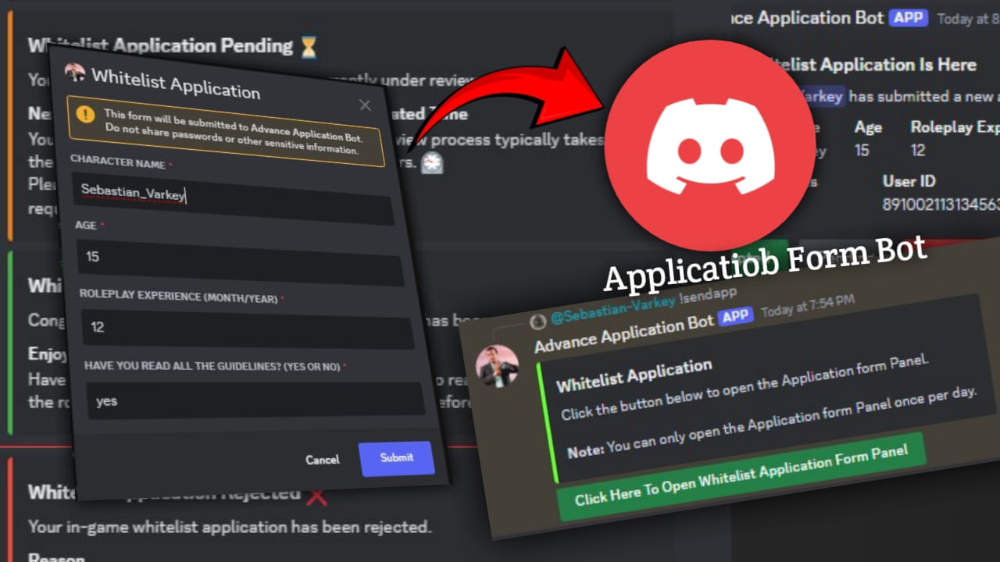

## Whitelist Application Form
- A bot for obtaining whitelist access. Note: This is not the full version and may contain bugs.

## 📌 Top Commands

- **s!help**: Display available commands.
- **s!prefix**: Change command prefix.
- **s!test**: Get information about a specific command.
- **s!ping**: Check bot latency.
- **s!joininterview**: Join the waiting voice room for high-frequency move (optional).
- **s!leaveinterview**: Leave the waiting room (optional).

## 🛠️ Setup

1, Make Bot
- Create a bot account on Discord. 
    - Go to [https://discord.com/developers/applications](https://discord.com/developers/applications)
    - Click on "New Application"
    - Give the application a name and click on "Create"
    - Click the bot section on the right
    - Click on reset TOKEN
    - Copy the token
2. Edit `Config.js`
   - Add the token in the `TOKEN-HERE` area.

4. Run the bot.

5. Use the `!sendapp` command
   - Use this command in the section where you want the whitelist application to be sent.

## 🤝 Supporters and Contributors

- Supported By [TEAM God Dc Developers](https://discord.gg/apF2ZBXZVF)
- **Sub-Developers**: damn.itx.fazy & n0t.see & Ameen Babu
- **Helpers**: santa_.k

## 🌱 Contributing

Contributions are welcome! If you'd like to contribute, fork the repository and create a pull request with your changes.

# 🚀 Stay tuned for the V2 update

##### Powered by GOD DC DEVELOPER COMMUNITY
